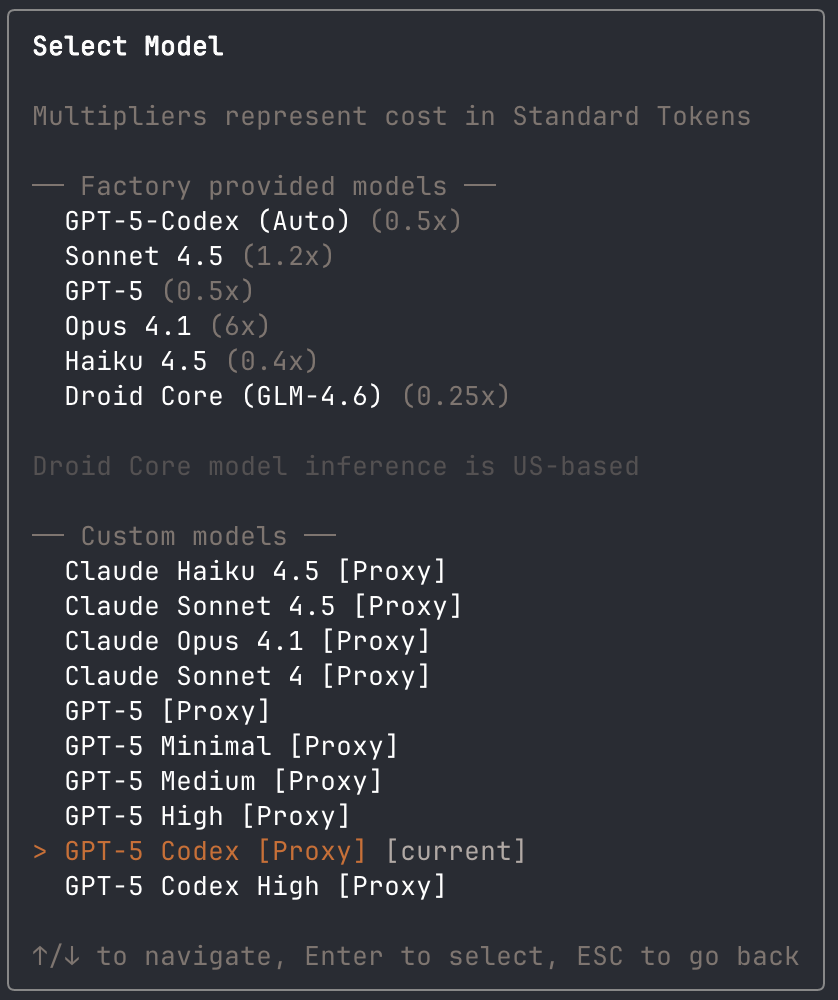
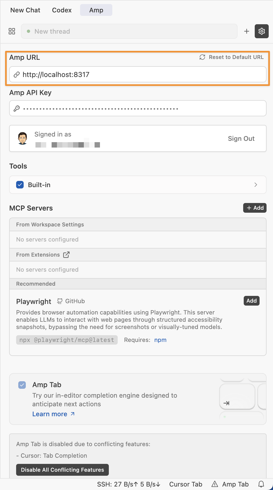

# Using Factory CLI (Droid) and Amp CLI with ChatGPT/Claude Subscriptions (OAuth)


## Why Use Subscriptions Instead of API Keys or Pass-Through Pricing?

Using Factory CLI (droid) or Amp CLI/IDE with this CLIProxyAPI fork lets you leverage your **existing provider subscriptions** (ChatGPT Plus/Pro, Claude Pro/Max) instead of per-token API billing. 

**The value proposition is compelling:**
- **ChatGPT Plus/Pro** ($20-200/month) includes substantial use based on 5h and weekly quota limits
- **Claude Pro/Max** ($20-100-200/month) includes substantial Claude Sonnet 4.5 and Opus 4.1 on 5h and weekly quota limits
- **Pay-per-token APIs** can cost 5-10x+ for equivalent usage, even with pass-through pricing and no markup

By using OAuth subscriptions through this proxy, you get significantly better value while using the powerful CLI and IDE harnesses from Factory and AmpCode.

## Disclaimer

- This project is for personal/educational use only. You are solely responsible for how you use it.  
- Using reverse proxies or alternate API bases may violate provider Terms of Service (OpenAI, Anthropic, Google, etc.).  
- Accounts can be rate-limited, locked, or banned. Credentials and data may be at risk if misconfigured.  
- Do not use to resell access, bypass access controls, or otherwise abuse services.  
- No warranties. Use at your own risk.

## Summary

- Run Factory CLI (droid) and Amp CLI through a single local proxy server.  
- This fork keeps all upstream Factory compatibility and adds Amp-specific support:
  - Provider route aliases for Amp: `/api/provider/{provider}/v1...`
  - Amp OAuth/management upstream proxy
  - Smart secret resolution and automatic gzip handling
- Outcome: one proxy for both tools, minimal switching, clean separation of Amp supporting code from upstream repo.

## Why This Fork?

- Upstream maintainers chose not to include Amp-specific routing to keep scope focused on pure proxy functionality.  
- Amp CLI expects Amp-specific alias routes and management endpoints the upstream CLIProxyAPI does not expose.  
- This fork adds:
  - Route aliases: `/api/provider/{provider}/v1...`
  - Amp upstream proxy and OAuth
  - Localhost-only access controls for Amp management routes (secure-by-default)
- Amp-specific code is isolated under `internal/api/modules/amp`, reducing merge conflicts with upstream.

## Architecture Overview

### Factory (droid) flow

```mermaid
flowchart LR
  A[Factory CLI (droid)] -->|OpenAI/Claude-compatible calls| B[CLIProxyAPI Fork]
  B -->|/v1/chat/completions, /v1/messages, /v1/models| C[Translators/Router]
  C -->|OAuth tokens| D[(Providers)]
  D -->|OpenAI Codex / Claude| E[Responses+Streaming]
  E --> B --> A
```

### Amp flow

```mermaid
flowchart LR
  A[Amp CLI] -->|/api/provider/{provider}/v1...| B[CLIProxyAPI Fork]
  B -->|Route aliases map to upstream /v1 handlers| C[Translators/Router]
  A -->|/api/auth, /api/user, /api/meta, /api/threads...| B
  B -->|Amp upstream proxy (config: amp-upstream-url)| F[(ampcode.com)]
  C -->|OpenAI / Anthropic| D[(Providers)]
  D --> B --> A
```

### Notes

- Factory uses standard OpenAI-compatible routes under `/v1/...`.  
- Amp uses `/api/provider/{provider}/v1...` plus management routes proxied to `amp-upstream-url`.  
- Management routes are restricted to localhost by default.

## Prerequisites

- Go 1.24+  
- Active subscriptions:
  - **ChatGPT Plus/Pro** (for GPT-5/GPT-5 Codex via OAuth)
  - **Claude Pro/Max** (for Claude models via OAuth)
  - **Amp** (for Amp CLI features in this fork)
- CLI tools:
  - Factory CLI (droid)
  - Amp CLI
- Local port `8317` available (or choose your own in config)

## Installation & Build

### Clone and build:

```bash
git clone https://github.com/ben-vargas/ai-cli-proxy-api.git
cd ai-cli-proxy-api
```

**macOS/Linux:**
```bash
go build -o cli-proxy-api ./cmd/server
```

**Windows:**
```bash
go build -o cli-proxy-api.exe ./cmd/server
```

### Homebrew (Factory CLI only):

> **⚠️ Note:** The Homebrew package installs the upstream version without Amp CLI support. Use the git clone method above if you need Amp CLI functionality.

```bash
brew install cliproxyapi
brew services start cliproxyapi
```

## OAuth Setup

Run these commands in the repo folder after building to authenticate with your subscriptions:

### OpenAI (ChatGPT Plus/Pro for GPT-5/Codex):

```bash
./cli-proxy-api --codex-login
```

- Opens browser on port `1455` for OAuth callback
- Requires active ChatGPT Plus or Pro subscription
- Tokens saved to `~/.cli-proxy-api/codex-<email>.json`

### Claude (Anthropic for Claude models):

```bash
./cli-proxy-api --claude-login
```

- Opens browser on port `54545` for OAuth callback
- Requires active Claude Pro or Claude Max subscription
- Tokens saved to `~/.cli-proxy-api/claude-<email>.json`

**Tip:** Add `--no-browser` to print the login URL instead of opening a browser (useful for remote/headless servers).

## Configuration for Factory CLI

Factory CLI uses `~/.factory/config.json` to define custom models. Add entries to the `custom_models` array.

### Complete configuration example

Copy this entire configuration to `~/.factory/config.json` for quick setup:

```json
{
  "custom_models": [
    {
      "model_display_name": "Claude Haiku 4.5 [Proxy]",
      "model": "claude-haiku-4-5-20251001",
      "base_url": "http://localhost:8317",
      "api_key": "dummy-not-used",
      "provider": "anthropic"
    },
    {
      "model_display_name": "Claude Sonnet 4.5 [Proxy]",
      "model": "claude-sonnet-4-5-20250929",
      "base_url": "http://localhost:8317",
      "api_key": "dummy-not-used",
      "provider": "anthropic"
    },
    {
      "model_display_name": "Claude Opus 4.1 [Proxy]",
      "model": "claude-opus-4-1-20250805",
      "base_url": "http://localhost:8317",
      "api_key": "dummy-not-used",
      "provider": "anthropic"
    },
    {
      "model_display_name": "Claude Sonnet 4 [Proxy]",
      "model": "claude-sonnet-4-20250514",
      "base_url": "http://localhost:8317",
      "api_key": "dummy-not-used",
      "provider": "anthropic"
    },
    {
      "model_display_name": "GPT-5 [Proxy]",
      "model": "gpt-5",
      "base_url": "http://localhost:8317/v1",
      "api_key": "dummy-not-used",
      "provider": "openai"
    },
    {
      "model_display_name": "GPT-5 Minimal [Proxy]",
      "model": "gpt-5-minimal",
      "base_url": "http://localhost:8317/v1",
      "api_key": "dummy-not-used",
      "provider": "openai"
    },
    {
      "model_display_name": "GPT-5 Medium [Proxy]",
      "model": "gpt-5-medium",
      "base_url": "http://localhost:8317/v1",
      "api_key": "dummy-not-used",
      "provider": "openai"
    },
    {
      "model_display_name": "GPT-5 High [Proxy]",
      "model": "gpt-5-high",
      "base_url": "http://localhost:8317/v1",
      "api_key": "dummy-not-used",
      "provider": "openai"
    },
    {
      "model_display_name": "GPT-5 Codex [Proxy]",
      "model": "gpt-5-codex",
      "base_url": "http://localhost:8317/v1",
      "api_key": "dummy-not-used",
      "provider": "openai"
    },
    {
      "model_display_name": "GPT-5 Codex High [Proxy]",
      "model": "gpt-5-codex-high",
      "base_url": "http://localhost:8317/v1",
      "api_key": "dummy-not-used",
      "provider": "openai"
    }
  ]
}
```

After configuration, your custom models will appear in the `/model` selector:



### Required fields:

| Field | Required | Description | Example |
|-------|----------|-------------|---------|
| `model_display_name` | ✓ | Human-friendly name shown in `/model` selector | `"Claude Sonnet 4.5 [Proxy]"` |
| `model` | ✓ | Model identifier sent to API | `"claude-sonnet-4-5-20250929"` |
| `base_url` | ✓ | Proxy endpoint | `"http://localhost:8317"` or `"http://localhost:8317/v1"` |
| `api_key` | ✓ | API key (use `"dummy-not-used"` for proxy) | `"dummy-not-used"` |
| `provider` | ✓ | API format type | `"anthropic"`, `"openai"`, or `"generic-chat-completion-api"` |

### Provider-specific base URLs:

| Provider | Base URL | Reason |
|----------|----------|--------|
| `anthropic` | `http://localhost:8317` | Factory appends `/v1/messages` automatically |
| `openai` | `http://localhost:8317/v1` | Factory appends `/responses` (needs `/v1` prefix) |
| `generic-chat-completion-api` | `http://localhost:8317/v1` | For OpenAI Chat Completions compatible models |

### Using custom models:

1. Edit `~/.factory/config.json` with the models above
2. Restart Factory CLI (`droid`)
3. Use `/model` command to select your custom model

## Configuration for Amp CLI

Enable Amp integration (fork-specific):

In `config.yaml`:

```yaml
# Amp CLI integration
amp-upstream-url: "https://ampcode.com"

# Optional override; otherwise uses env or file (see precedence below)
# amp-upstream-api-key: "your-amp-api-key"

# Security: restrict management routes to localhost (recommended)
amp-restrict-management-to-localhost: true
```

### Secret resolution precedence

| Source                                  | Key                             | Priority |
|-----------------------------------------|----------------------------------|----------|
| Config file                             | `amp-upstream-api-key`           | High     |
| Environment                             | `AMP_API_KEY`                    | Medium   |
| Amp secrets file                        | `~/.local/share/amp/secrets.json`| Low      |

### Set Amp CLI to use this proxy

Edit `~/.config/amp/settings.json` and add the `amp.url` setting:

```json
{
  "amp.url": "http://localhost:8317"
}
```

Or set the environment variable:

```bash
export AMP_URL=http://localhost:8317
```

Then login (proxied via `amp-upstream-url`):

```bash
amp login
```

Use Amp as normal:

```bash
amp "Hello, world!"
```

### Supported Amp routes

**Provider Aliases (always available):**
- `/api/provider/openai/v1/chat/completions`
- `/api/provider/openai/v1/responses`
- `/api/provider/anthropic/v1/messages`
- And related provider routes/versions your Amp CLI calls

**Management Routes (require `amp-upstream-url`):**
- `/api/auth`, `/api/user`, `/api/meta`, `/api/internal`, `/api/threads`, `/api/telemetry`
- Localhost-only by default for security

### Works with Amp IDE Extension

This proxy configuration also works with the Amp IDE extension for VSCode and forks (Cursor, Windsurf, etc). Simply set the Amp URL in your IDE extension settings:

1. Open Amp extension settings in your IDE
2. Set **Amp URL** to `http://localhost:8317`
3. Login with your Amp account
4. Start using Amp in your IDE with the same OAuth subscriptions!



The IDE extension uses the same routes as the CLI, so both can share the proxy simultaneously.

## Running the Proxy

> **Important:** The proxy requires a config file with `port` set (e.g., `port: 8317`). There is no built-in default port.

### With config file:

```bash
./cli-proxy-api --config config.yaml
```

If `config.yaml` is in the current directory:

```bash
./cli-proxy-api
```

### Tmux (recommended for remote servers):

Running in tmux keeps the proxy alive across SSH disconnects:

**Start proxy in detached tmux session:**
```bash
tmux new-session -d -s proxy -c ~/ai-cli-proxy-api \
  "./cli-proxy-api --config config.yaml"
```

**View/attach to proxy session:**
```bash
tmux attach-session -t proxy
```

**Detach from session (proxy keeps running):**
```
Ctrl+b, then d
```

**Stop proxy:**
```bash
tmux kill-session -t proxy
```

**Check if running:**
```bash
tmux has-session -t proxy && echo "Running" || echo "Not running"
```

**Optional: Add to `~/.bashrc` for convenience:**
```bash
alias proxy-start='tmux new-session -d -s proxy -c ~/ai-cli-proxy-api "./cli-proxy-api --config config.yaml" && echo "Proxy started (use proxy-view to attach)"'
alias proxy-view='tmux attach-session -t proxy'
alias proxy-stop='tmux kill-session -t proxy 2>/dev/null && echo "Proxy stopped"'
alias proxy-status='tmux has-session -t proxy 2>/dev/null && echo "✓ Running" || echo "✗ Not running"'
```

### As a service (examples):

**Homebrew:**
```bash
brew services start cliproxyapi
```

**Systemd/Docker:** use your standard service templates; point the binary and config appropriately

### Key config fields (example)

```yaml
port: 8317
auth-dir: "~/.cli-proxy-api"
debug: false
logging-to-file: true

remote-management:
  allow-remote: false
  secret-key: ""           # leave empty to disable management API
  disable-control-panel: false

# Amp integration
amp-upstream-url: "https://ampcode.com"
# amp-upstream-api-key: "your-amp-api-key"
amp-restrict-management-to-localhost: true

# Retries and quotas
request-retry: 3
quota-exceeded:
  switch-project: true
  switch-preview-model: true
```

## Usage Examples

### Factory

**List models:**
```bash
curl http://localhost:8317/v1/models
```

**Chat Completions (Claude):**
```bash
curl -s http://localhost:8317/v1/messages \
  -H "Content-Type: application/json" \
  -d '{
    "model": "claude-sonnet-4-5-20250929",
    "messages": [{"role": "user", "content": "Hello"}],
    "max_tokens": 1024
  }'
```

### Amp

**Provider alias (OpenAI-style):**
```bash
curl -s http://localhost:8317/api/provider/openai/v1/chat/completions \
  -H "Content-Type: application/json" \
  -d '{
    "model": "gpt-5",
    "messages": [{"role": "user", "content": "Hello"}]
  }'
```

**Management (localhost only by default):**
```bash
curl -s http://localhost:8317/api/user
```

## Troubleshooting

### Common errors and fixes

| Symptom/Code                             | Likely Cause                                         | Fix                                                                 |
|------------------------------------------|------------------------------------------------------|----------------------------------------------------------------------|
| 404 /v1/chat/completions                  | Factory not pointing to proxy base                   | Set base to `http://localhost:8317/v1` (env/flag/config).           |
| 404 /api/provider/...                     | Incorrect route path or typo                  | Ensure you're calling `/api/provider/{provider}/v1...` paths exactly.|
| 403 on /api/user (Amp)                    | Management restricted to localhost                   | Run from same machine or set `amp-restrict-management-to-localhost: false` (not recommended). |
| 401/403 from provider                     | Missing/expired OAuth or API key                     | Re-run the relevant `--*-login` or configure keys in `config.yaml`. |
| 429/Quota exceeded                        | Project/model quota exhausted                        | Enable `quota-exceeded` switching or switch accounts.               |
| 5xx from provider                         | Upstream transient error                             | Increase `request-retry` and try again.                             |
| SSE/stream stuck                          | Client not handling SSE properly                     | Use SSE-capable client or set `stream: false`.                      |
| Amp gzip decoding errors                  | Compressed upstream responses                        | Fork auto-decompresses; update to latest build if issue persists.   |
| CORS errors in browser                    | Protected management endpoints                       | Use CLI/terminal; avoid browsers for management endpoints.          |
| Wrong model name                          | Provider alias mismatch                               | Use `gpt-*` for OpenAI or `claude-*` for Anthropic models. |

### Diagnostics

- Check logs (`debug: true` temporarily or `logging-to-file: true`).  
- Verify config in effect: print effective config or confirm with startup logs.  
- Test base reachability: `curl http://localhost:8317/v1/models`.  
- For Amp, verify `amp-upstream-url` and secrets resolution.

## Security Checklist

- Keep `amp-restrict-management-to-localhost: true` (default).  
- Do not expose the proxy publicly; bind to localhost or protect with firewall/VPN.  
- If enabling remote management, set `remote-management.secret-key` and TLS/ingress protections.  
- Disable the built-in management UI if hosting your own:
  - `remote-management.disable-control-panel: true`
- Rotate tokens/keys; store config and auth-dir on encrypted disk or managed secret stores.  
- Keep binary up to date to receive security fixes.

## References

- This fork README: [README.md](README.md)
- Upstream project: [CLIProxyAPI](https://github.com/router-for-me/CLIProxyAPI)
- Amp CLI: [Official Manual](https://ampcode.com/manual)
- Factory CLI (droid): [Official Documentation](https://docs.factory.ai/cli/getting-started/overview)
